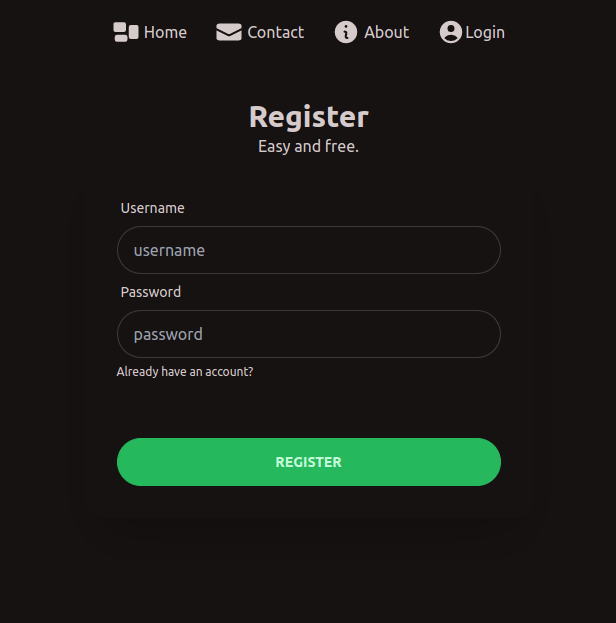

# Taskology

As a former project coordinator I am a well organised person and who loves to stay on top of her todos on the go. Therefore I created a productivity app for busy people who don't want the overhead of a full productivity or project management app (similar to [Wunderlist](https://en.wikipedia.org/wiki/Wunderlist) which was the main inspiration for this app).

## Description

Taskology is a progressive web (PWA) app that lets you create task lists that you can share with friends. Once you log in you can create lists and tasks with an intuitive interface. You can share lists with other registered users. Your friends can see when you tick off a task in (near) real time.

- Lists are shareable in (almost) real time.
- Intuitive highly customizable UI.
- Location feature

### The Fun Feature

The app lets you choose from a variety of themes depending on your needs or your mood. See Screenshots below. All color themes come with [DaisyUI](https://daisyui.com/).

### The Extra

The extra feature that makes Taskology different from other list apps is the location feature. When you click on the location pin of your list or your task the app takes you directly to google maps to show you the location.
If the name of the list is a specific place google, maps will take you to the location. If you choose a more generic term, maps will perform a search in your current surroundings.

## Technologies

- I designed my data schema with DrawSQL and use a PostgreSQL database, migrations are done with Ley.

- I used React Next.js with Typescript and Node.js to build the app
- Date Fetching is done with GraphQL Apollo
- I implemented full user authentication incl. session tokens plus authorizations
- UI Design & Prototyping was done in ExcaliDraw
- The design is fully responsive and was implemented with Tailwind & Daisy UI
- I did E2E and unit test
- Deployed on Fly.io: https://taskology.fly.dev/
- Continuous Integration with GitHub Actions
- This app is a PWA (progressive web app)

## To Do Backlog

- Use a websocket for synchronising lists between users.
- Add two-factor authentication for better security
- Make Taskology 100% keyboard navigatable to improve accessiblity
- and more ...

## Set up

- Clone the repository with `git clone git@github.com:KatharinaSimma/final-project.git`
- Setup the database by downloading and installing PostgreSQL
- Create a user and a database
- Create a new file `.env`
- Copy the environment variables from `.env-example` into `.env`
- Replace the placeholders xxxxx with your username, password and name of database
- Install dotenv-cli with `yarn add dotenv-cli`
- Run `yarn install` in your command line
- Run the migrations with `yarn migrate up`
- Start the server by running `yarn dev`

## Impressions

### Registration Screen (Color theme: Forest)

