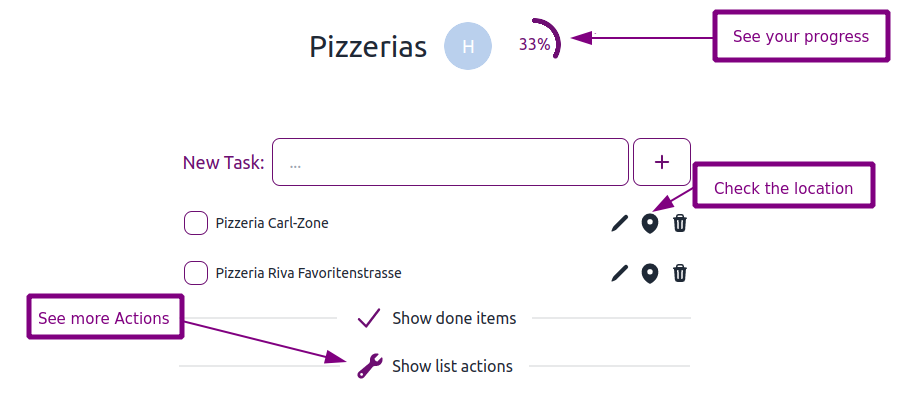
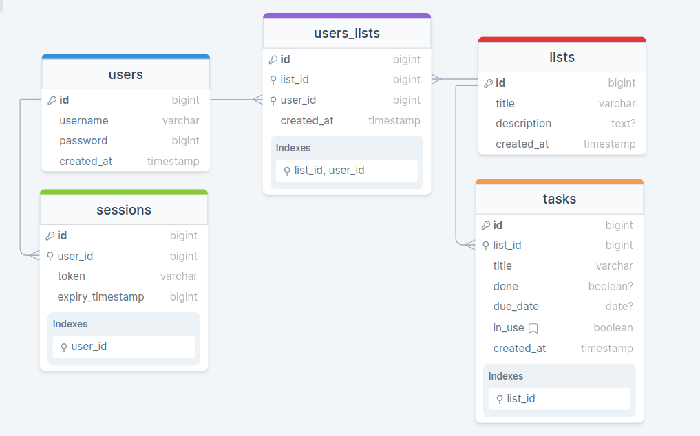

# Taskology

As a former project coordinator I am a well organised person and who loves to stay on top of her todos on the go.

## Description

Taskology is a progressive web (PWA) app that lets you create task lists that you can share with friends. Once you log in you can create lists and tasks with an intuitive interface. You can share lists with other registered users. Your friends can see when you tick off a task in (near) real time.
The main goal of the app is to provide the simplest list functionality without the overhead of a big todo or project management app.

### The Fun Feature

The app lets you choose from a variety of themes depending on your needs or your mood. Pro Tipp: Check out "valentine" for the cosy experience and "cyberpunk" in case you need to wake up ;-)

### The Extra

The extra feature that makes Taskology different from other list apps is a location feature. When you click on the location pin of your list or your task Taskology takes you directly to google maps to show you the location of your list/task. There is two use cases for this:

1.  Imagine you share a shopping list with your spouse. Choose the name of the shop you want to buy froma as the title of your list. When you click on the map icon, google maps shows you all the location of the specific shop around your current location
2.  Imagine your frineds Arif and Daniel are sharing a love for kebap. They share a list with all the really good kebap places in Vienna. When Daniel clicks on a list item, google maps shows the location of this place. When Arif clicks on the title of the list, he'll see all kebap places around his location.

## Technologies

- I Designed my data scheme with DrawSQL and used PostgreSQL, Migrations for data management

- I used React Next.js with Typescript and Node.js to build the app
- Date Fetching is done with GraphQL Apollo
- I implemented full user authentication incl. session tokens plus authorizations
- UI Design & Prototyping was done in ExcaliDraw
- The design is fully responsive and was implemented with Tailwind & Daisy UI incl. themes
- I did E2E and unit test
- Deployed on Fly.io: https://taskology.fly.dev/

## To Do Backlog

- Use a websocket for synchronising lists between users.
- Add two-factor authentication for better security
- Make Taskology 100% keyboard navigatable to improve accessiblity
- and more ...

## Set up

1.  Clone the project
    https: `git clone git@github.com:KatharinaSimma/final-project.git`
2.  Install packages: `yarn`
3.  Run the app: `yarn dev`
4.  Go to localhost: http://localhost:3000/
